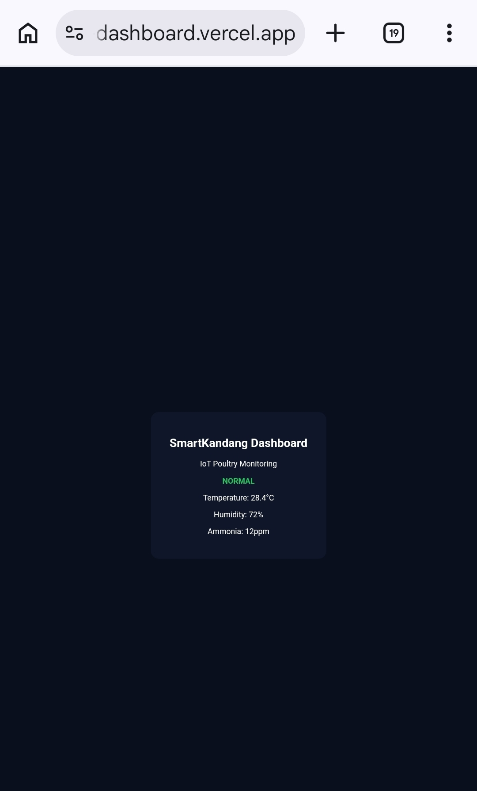

# SmartKandang IoT Dashboard

🚀 **Live Demo**  
https://smartkandang-iot-dashboard.vercel.app

---

## Dashboard Preview

SmartKandang is a mobile monitoring dashboard for poultry farms.  
This interface demonstrates how farmers can monitor environmental conditions inside chicken coops in real-time.

---

## Features

- Real-time livestock monitoring
- Temperature, humidity, ammonia, and lighting indicators
- Dashboard overview for multiple cages
- Early warning for dangerous conditions
- Alert monitoring system
- Sensor trend visualization

---

## System Overview

SmartKandang is designed as an IoT monitoring dashboard for poultry farms.

Sensor devices inside the chicken coop collect environmental data such as:

- Temperature
- Humidity
- Ammonia gas
- Lighting conditions

This data is visualized inside a monitoring dashboard so farmers can quickly detect unsafe conditions.

Typical architecture:
